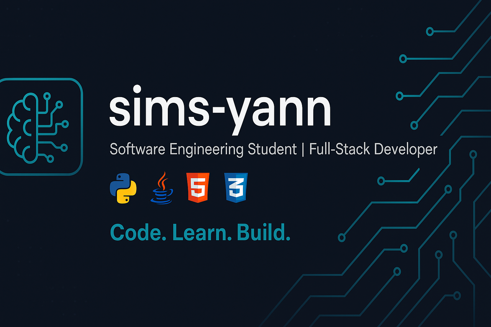

  

<h1 align="center">👋 Hi, I'm Yann</h1>

🎓 Software Engineering Student | 💻 Python Developer | 🤖 AI/ML & Full-Stack Development Enthusiast

  

---

## 🧠 About Me

I'm a passionate and driven software engineering student with hands-on experience in **full-stack development** and a growing specialization in **Python**, **Java**, **Web development** and **Mobile App Development**. I enjoy building secure, intelligent, and user-centered applications that solve real-world problems.

My work combines clean code with scalable architecture and thoughtful UI design. I thrive in collaborative environments and love learning from real projects.

---

## 🚀 Tech Stack

### 🛠️ Languages & Frameworks

### ⚙️ Tools & IDEs

---

## 📊 GitHub Stats

---

## 💼 What I Work On

- 🔐 Secure full-stack applications with JWT authentication and role-based access control  
- 📈 Data visualization tools and optimization systems  
- 🤖 Integrating ML models into real applications  
- 🎨 Clean and intuitive UI/UX designs  

---

## 🤝 Looking to Collaborate?

If you're a **recruiter** looking for a technically sound, fast-learning developer, or a **developer/team** looking to collaborate on meaningful software or AI projects — I’d love to connect.

---

## 📬 Contact & Projects

📫 Feel free to explore my work:  
👉 [github.com/sims-yann](https://github.com/sims-yann)

---

  
📌 What's Next?

- A smart delivery-routing app using graph algorithms  
- A dynamic AI-powered portfolio  
- Publishing technical blogs and tutorials to give back to the dev community  

